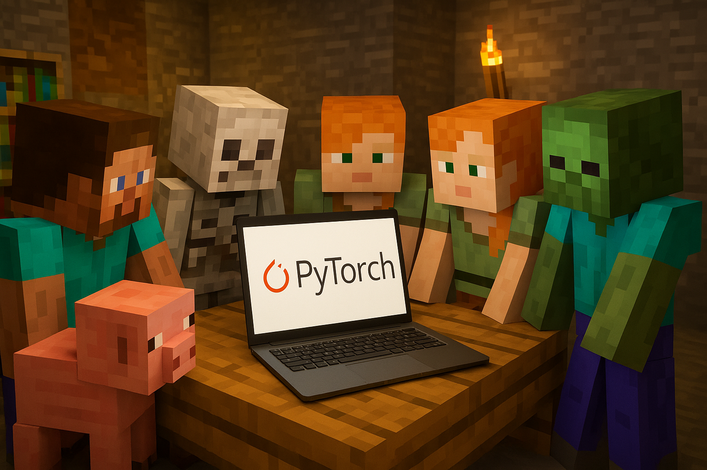

    
    <h1>Clear_PyTorch</h1>

# Clear_Pytorch

## 🎯 项目介绍

> &emsp;&emsp;*笔者在学习Pytorch的过程中一直思考一个问题：能否将Pytorch的学习压缩到七天，并同时为大家提供一个Pytorch面试题库以便练习。因此，笔者希望通过本项目，帮助大家熟练掌握这一工具。*

&emsp;&emsp;本项目是一个**系统性的 Pytorch 学习教程**，正在开发，预计一星期左右时间...
